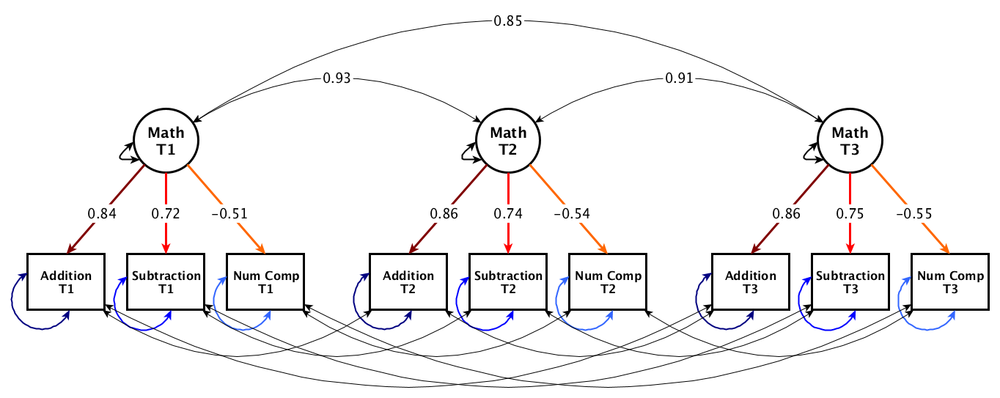
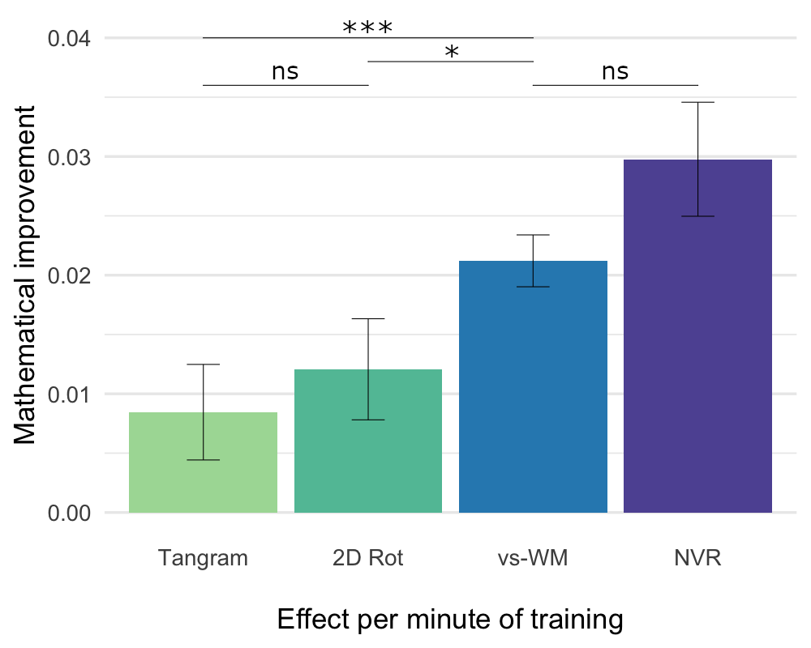

#Training spatial cognition enhances mathematical learning in a randomized study of 17,000 children

Nicholas Judd & Torkel Klinberg  
Department of Neuroscience  
Karolinska Institute  
Stockholm, Sweden  
Jan 13th, 2021  

| [UCL CEN talk](https://www.youtube.com/watch?v=hSxlmVWxZnA) | [Preprint](https://psyarxiv.com/z3pb7/) | [Cognition Matters](https://cognitionmatters.org/) | [Lab home page](http://www.klingberglab.se)  | 
| :---:   | :-: | :-: | :--: |

 

## Abstract 
Spatial and mathematical abilities are strongly associated. Here we analyzed data from 17,648 children, aged 6-8 years, who performed 7 weeks of mathematical training together with randomly assigned, spatial cognitive training with tasks demanding more of spatial manipulation (mental rotation or tangram), maintenance of spatial information (a visuo-spatial working memory task) or spatial, non-verbal reasoning. We found that what type of cognitive training children performed had a significant impact on mathematical learning, with training of visuo-spatial working memory and reasoning being the most effective. This large, community-based study shows that spatial cognitive training can result in transfer to academic abilities and that reasoning ability and maintenance of spatial information is relevant for math learning in young children.

  
 

#### Article
See [holder](insert.link) for the latest version of the manuscript. There is a preprint on [PsyArix](https://psyarxiv.com/z3pb7/) which includes extended supplementary information.

#### Overview of the repository
This repository includes the data and the code to reproduce the main analysis showing a difference in mathematical improvement between training plans. It does not include code to make the math composite (i.e., the strict measurement invariant CFA) nor the data or the code for the baseline characteristics analysis. 

This code was rewritten specifically for this repository. All reported results are from the local data and code, yet there should not be a discrepancy.

